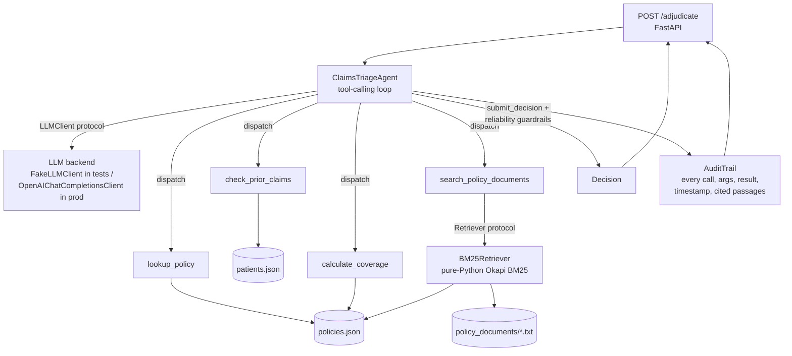
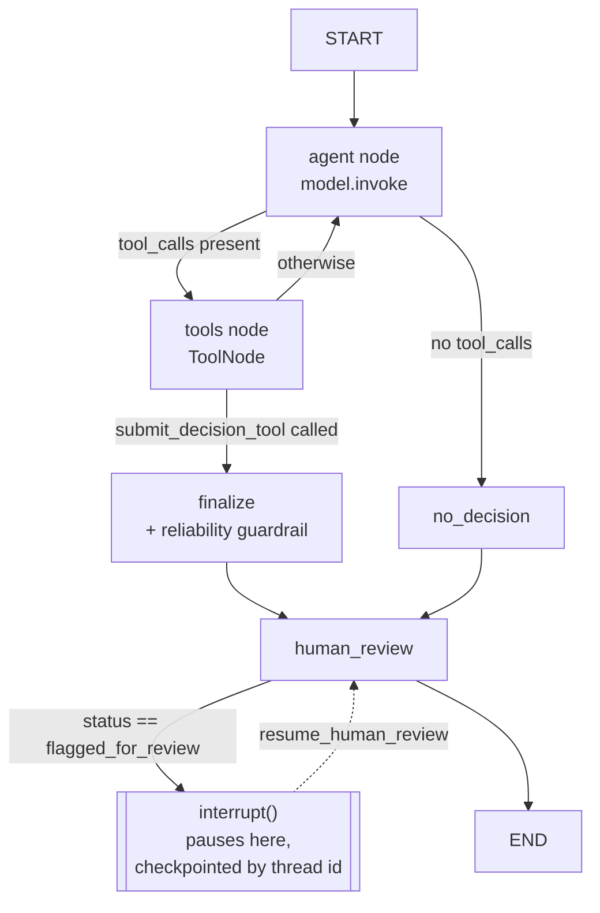

# claims-triage-agent

A tool-calling LLM agent that adjudicates health-insurance claims: it reads
a claim, calls tools to check things it cannot safely guess (coverage
rules, claim history, cost-sharing math, free-text policy clauses), and
returns a structured, justified, fully audited decision.

All data (patients, policies, claims, policy documents) is **synthetic and
invented** for this repository. No real patient data, real payer data, or
proprietary code is used anywhere here.

**A live request against `POST /adjudicate`** — the structured data says
this procedure is covered, but the agent finds and cites the free-text
exclusion clause that says otherwise, and denies the claim:


## Why this project

I built this as a public, from-scratch demonstration of what I consider
core to AI engineering in healthtech: an LLM agent that reads and reasons
over clinical/administrative documents, with reliability and auditability
treated as first-class requirements rather than an afterthought. It
mirrors, on an invented scenario, the architecture pattern I worked with
in my first professional experience building a production LLM agent
(document agents, RAG, tool orchestration) — nothing here is copied from
that codebase; it is the same category of engineering decisions, applied
to public synthetic data.

## Stack

Python · LangGraph (`StateGraph`, conditional edges, checkpointing,
`interrupt()`/Human-in-the-Loop) · LangChain Core (`@tool`, `BaseChatModel`) ·
RAG (from-scratch BM25) · Pydantic v2 · FastAPI · Docker · GitHub Actions CI
(ruff + mypy + pytest + docker build) · optional LangSmith tracing via env vars.

Deliberately **not** included: Kubernetes, a graph database (Neo4j/TigerGraph),
MCP, OpenTelemetry. None of them would do real work in a single-service demo
this size — adding them would be padding, not engineering. If this were a
production, multi-service deployment, OpenTelemetry would be the first of
those worth adding (structured tracing spans alongside, or instead of, the
JSON audit trail — see "Limitations").

## Architecture



Key design decisions:

- **Swappable LLM and retriever, via `Protocol`s.** `agent.py` depends only
  on `LLMClient` and `Retriever` protocols (`llm_client.py`,
  `retriever.py`), never on a concrete SDK. That's what lets the whole
  tool-calling loop — including the reliability guardrails below — be unit
  tested with a scripted `FakeLLMClient` and zero network access or API
  key.
- **Dataclasses for the domain model, pydantic only at the HTTP edge.**
  `schema.py` defines the internal domain objects (`Claim`, `Decision`,
  `AuditTrail`, ...) as plain dataclasses. `api.py` is the only module
  that imports FastAPI/pydantic, converting between the two at the
  boundary. This keeps `tools.py`, `retriever.py` and `agent.py` testable
  without a web-framework dependency at all.
- **BM25 implemented from scratch, not via `rank_bm25`.** The retriever
  (`retriever.py`) is a from-scratch, ~50-line Okapi BM25 implementation
  over the policy documents, chunked by section. This was a deliberate
  choice to keep the retrieval layer dependency-free (stdlib only) and
  easy to audit line-by-line; the `Retriever` protocol makes it a drop-in
  swap for `rank_bm25`, a different lexical index, or a vector store later
  without touching `agent.py`.

## Two orchestrators, same domain logic

The agent is implemented **twice**, deliberately, sharing the exact same
`tools.py`, `retriever.py`, and reliability rule
(`agent.apply_reliability_guardrails`):

- **`agent.ClaimsTriageAgent`** — a hand-rolled `while` loop against a
  plain `LLMClient` protocol. Zero third-party dependencies. This is the
  one `api.py` uses by default.
- **`agent_langgraph.LangGraphClaimsTriageAgent`** — the same agent as an
  explicit LangGraph `StateGraph`: real nodes/conditional edges, a
  `ToolNode`, an `InMemorySaver` checkpointer, and a genuine
  `interrupt()` call for Human-in-the-Loop review (see below). This is
  the industry-standard 2026 orchestration primitive, built explicitly
  rather than hidden behind a one-line `create_react_agent(...)` call.



Why build it twice rather than just once with LangGraph: it shows both
that I understand what a tool-calling agent loop actually does
underneath, and that I can build the same thing with the framework a
production team would actually use day to day.

### Human-in-the-loop, for real

The `human_review` node is where the reliability guardrail becomes an
actual pause, not just a status label: whenever a decision resolves to
`flagged_for_review` — whether the model asked for it directly, or the
guardrail forced it — the graph calls `interrupt()` and genuinely stops
executing there, checkpointed by `run_id` (thread id). A human reviewer
resumes it later with `LangGraphClaimsTriageAgent.resume_human_review(run_id, final_status, reviewer_notes)`,
which can confirm or overturn the flagged decision. This is exercised in
`tests/test_agent_langgraph.py::test_human_review_resume_can_overturn_a_flagged_decision`.

## Reliability guardrails

Two things are enforced deterministically in `agent.py`, not left to the
model's judgement:

1. **Tool-call budget.** If the model hasn't reached `submit_decision`
   within `max_tool_calls` (default 8) tool calls, the run is
   force-terminated as `flagged_for_review` rather than looping
   indefinitely.
2. **Ungrounded decisions after an empty RAG search.** If any
   `search_policy_documents` call in the run came back empty (nothing
   cleared the retriever's relevance threshold) and the final decision
   doesn't cite any retrieved passage, the decision is overridden to
   `flagged_for_review`. The agent is not allowed to approve or deny a
   claim "from memory" when the free-text lookup it itself asked for came
   back empty.

Both overrides set `Decision.override_reason` and are exercised explicitly
in `tests/test_agent.py`
(`test_agent_forces_flagged_for_review_when_tool_call_budget_is_exceeded`,
`test_agent_forces_flagged_for_review_when_rag_is_empty_and_uncited`).

## Proving the RAG path is load-bearing

`data/claims/CLM-1001.json` is a skin-tag-removal claim where the
*structured* `policies.json` table says the procedure code IS covered —
so an agent that only calls `lookup_policy` would wrongly approve it. The
only way to reach the correct `denied` decision is by retrieving and
citing the free-text cosmetic-exclusion clause in `POL-1001.txt` (Section
4) via `search_policy_documents`. This case is asserted directly in
`tests/test_agent.py::test_agent_denies_cosmetic_removal_using_only_the_free_text_clause`
and is `eval/eval_cases.json`'s first case — and it's exactly what the
screenshot above shows happening live.

## Demo (no API key needed)

```bash
pip install -r requirements.txt
pip install -e .
uvicorn claims_triage_agent.demo:app --reload
```

Then open **http://localhost:8000/docs** and `POST /adjudicate` with one of
the 4 synthetic claims in `src/claims_triage_agent/data/claims/`
(`CLM-1001.json` .. `CLM-1004.json`). You'll see the real agent run: real
tool calls (`lookup_policy`, `search_policy_documents`, ...), real BM25
retrieval, the real reliability guardrails, and a real structured audit
trail in the response — all through the actual `ClaimsTriageAgent` loop and
`api.py` FastAPI app, no mocking of the orchestration layer.

**What this is not:** `claims_triage_agent.demo` wires
`ReferenceScriptLLMClient` in place of a real model — it replays the exact
same hand-written, known-correct tool-call trajectories
(`demo_scripts.DEMO_SCRIPTS`) that `eval/run_eval.py --llm fake-reference`
uses offline. It only knows how to answer for those 4 specific claim ids;
it is not a real LLM and cannot adjudicate an arbitrary claim. **This demo
proves the architecture works — the audit trail, the RAG path, the
reliability guardrails — it is not evidence of any model's adjudication
quality.** For a real accuracy number against a real model, run:

```bash
export OPENAI_API_KEY=sk-...
python eval/run_eval.py --llm openai
```

## Running it

```bash
python -m venv .venv && source .venv/bin/activate
pip install -r requirements.txt
pip install -e .

# Run the API locally
uvicorn claims_triage_agent.api:create_app --factory --reload
# NOTE: create_app requires an LLMClient argument; for local manual testing,
# wire up OpenAIChatCompletionsClient() (needs OPENAI_API_KEY) or write a
# 3-line ASGI entrypoint that does `app = create_app(OpenAIChatCompletionsClient())`.

# Run the tests
pytest -v

# Run the eval harness offline (no API key needed)
python eval/run_eval.py --llm fake-reference

# Run the eval harness against a real model
export OPENAI_API_KEY=sk-...
python eval/run_eval.py --llm openai

# Lint and type-check
ruff check .
mypy src/

# Run the LangGraph orchestrator against a real model instead of the hand-rolled one
# (needs `pip install langchain-openai`)
python -c "
from langchain_openai import ChatOpenAI
from claims_triage_agent.agent_langgraph import LangGraphClaimsTriageAgent
from claims_triage_agent.retriever import BM25Retriever
import json
claim = json.load(open('src/claims_triage_agent/data/claims/CLM-1001.json'))
agent = LangGraphClaimsTriageAgent(ChatOpenAI(model='gpt-4o-mini'), BM25Retriever())
print(agent.run(claim).decision)
"

# Optional: full LangSmith tracing of every LangGraph run, no code change needed
export LANGCHAIN_TRACING_V2=true
export LANGCHAIN_API_KEY=ls__...

# Build and run the Docker image
docker build -t claims-triage-agent .
docker run -p 8000:8000 -e OPENAI_API_KEY=sk-... claims-triage-agent
```

CI (`.github/workflows/ci.yml`) runs `ruff check`, `mypy`, `pytest`, and
a Docker build on every push/PR to `main`.

## Testing status

This project was originally written in a sandboxed environment with no
network access, so `agent_langgraph.py`, `tests/test_agent_langgraph.py`,
`api.py` and `tests/test_api.py` were only hand-reviewed, never actually
run. That gap has since been closed: `ruff`, `mypy` and the full `pytest`
suite have now all been run for real, with network access, against the
dependency versions below.

Versions actually installed and tested against:

| Package | Version |
|---|---|
| Python | 3.12 |
| langgraph | 1.2.12 |
| langchain-core | 1.6.4 |
| fastapi | 0.141.1 |
| pydantic | 2.13.5 |

`pyproject.toml`/`requirements.txt` pin `langgraph>=1.0` and
`langchain-core>=1.0`: pre-1.0 releases of both have a materially
different `StateGraph.invoke()`/checkpointer API (no `version=` overload
split, different `RunnableConfig` typing expectations) and are **not**
compatible with `agent_langgraph.py` as written. The original
`>=0.2`/`>=0.3` floors in an earlier revision of this file were wrong —
they were guesses made without network access to actually check.

