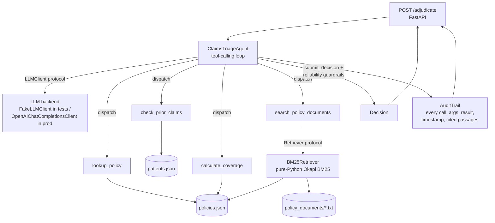
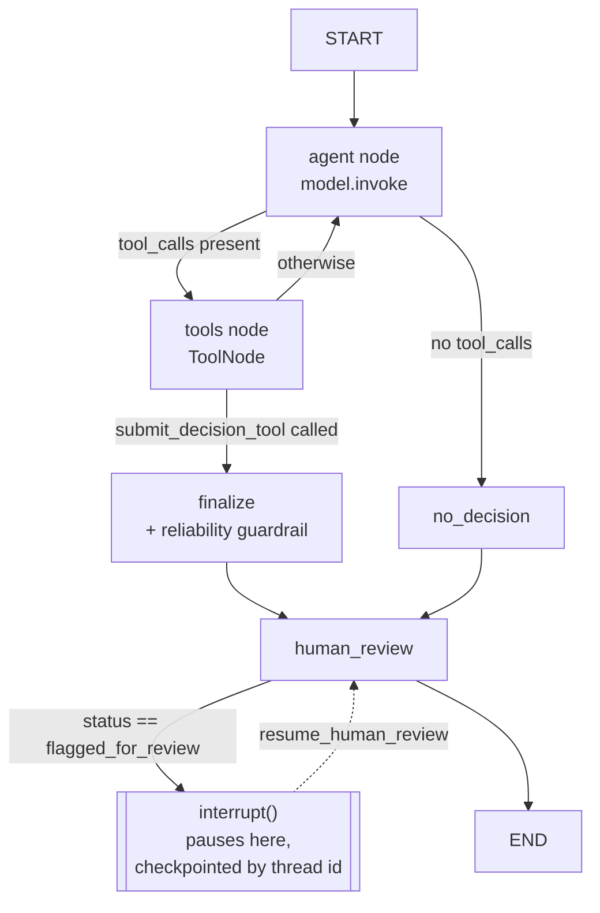

# claims-triage-agent

A tool-calling LLM agent that adjudicates health-insurance claims: it reads
a claim, calls tools to check things it cannot safely guess (coverage
rules, claim history, cost-sharing math, free-text policy clauses), and
returns a structured, justified, fully audited decision.

All data (patients, policies, claims, policy documents) is **synthetic and
invented** for this repository. No real patient data, real payer data, or
proprietary code is used anywhere here.

**A live request against `POST /adjudicate`** — the structured data says
this procedure is covered, but the agent finds and cites the free-text
exclusion clause that says otherwise, and denies the claim:


## Why this project

I built this as a public, from-scratch demonstration of what I consider
core to AI engineering in healthtech: an LLM agent that reads and reasons
over clinical/administrative documents, with reliability and auditability
treated as first-class requirements rather than an afterthought. It
mirrors, on an invented scenario, the architecture pattern I worked with
in my first professional experience building a production LLM agent
(document agents, RAG, tool orchestration) — nothing here is copied from
that codebase; it is the same category of engineering decisions, applied
to public synthetic data.

## Stack

Python · LangGraph (`StateGraph`, conditional edges, checkpointing,
`interrupt()`/Human-in-the-Loop) · LangChain Core (`@tool`, `BaseChatModel`) ·
RAG (from-scratch BM25) · Pydantic v2 · FastAPI · Docker · GitHub Actions CI
(ruff + mypy + pytest + docker build) · optional LangSmith tracing via env vars.

Deliberately **not** included: Kubernetes, a graph database (Neo4j/TigerGraph),
MCP, OpenTelemetry. None of them would do real work in a single-service demo
this size — adding them would be padding, not engineering. If this were a
production, multi-service deployment, OpenTelemetry would be the first of
those worth adding (structured tracing spans alongside, or instead of, the
JSON audit trail — see "Limitations").

## Architecture



Key design decisions:

- **Swappable LLM and retriever, via `Protocol`s.** `agent.py` depends only
  on `LLMClient` and `Retriever` protocols (`llm_client.py`,
  `retriever.py`), never on a concrete SDK. That's what lets the whole
  tool-calling loop — including the reliability guardrails below — be unit
  tested with a scripted `FakeLLMClient` and zero network access or API
  key.
- **Dataclasses for the domain model, pydantic only at the HTTP edge.**
  `schema.py` defines the internal domain objects (`Claim`, `Decision`,
  `AuditTrail`, ...) as plain dataclasses. `api.py` is the only module
  that imports FastAPI/pydantic, converting between the two at the
  boundary. This keeps `tools.py`, `retriever.py` and `agent.py` testable
  without a web-framework dependency at all.
- **BM25 implemented from scratch, not via `rank_bm25`.** The retriever
  (`retriever.py`) is a from-scratch, ~50-line Okapi BM25 implementation
  over the policy documents, chunked by section. This was a deliberate
  choice to keep the retrieval layer dependency-free (stdlib only) and
  easy to audit line-by-line; the `Retriever` protocol makes it a drop-in
  swap for `rank_bm25`, a different lexical index, or a vector store later
  without touching `agent.py`.

## Two orchestrators, same domain logic

The agent is implemented **twice**, deliberately, sharing the exact same
`tools.py`, `retriever.py`, and reliability rule
(`agent.apply_reliability_guardrails`):

- **`agent.ClaimsTriageAgent`** — a hand-rolled `while` loop against a
  plain `LLMClient` protocol. Zero third-party dependencies. This is the
  one `api.py` uses by default.
- **`agent_langgraph.LangGraphClaimsTriageAgent`** — the same agent as an
  explicit LangGraph `StateGraph`: real nodes/conditional edges, a
  `ToolNode`, an `InMemorySaver` checkpointer, and a genuine
  `interrupt()` call for Human-in-the-Loop review (see below). The graph
  is wired node by node, rather than hidden behind a one-line
  `create_react_agent(...)` call.



Why build it twice rather than just once with LangGraph: it shows both
that I understand what a tool-calling agent loop actually does
underneath, and that I can build the same thing with the framework a
production team would actually use day to day.

### Human-in-the-loop, for real

The `human_review` node is where the reliability guardrail becomes an
actual pause, not just a status label: whenever a decision resolves to
`flagged_for_review` — whether the model asked for it directly, or the
guardrail forced it — the graph calls `interrupt()` and genuinely stops
executing there, checkpointed by `run_id` (thread id). A human reviewer
resumes it later with `LangGraphClaimsTriageAgent.resume_human_review(run_id, final_status, reviewer_notes)`,
which can confirm or overturn the flagged decision. This is exercised in
`tests/test_agent_langgraph.py::test_human_review_resume_can_overturn_a_flagged_decision`.

## Reliability guardrails

Two things are enforced deterministically in `agent.py`, not left to the
model's judgement:

1. **Tool-call budget.** If the model hasn't reached `submit_decision`
   within `max_tool_calls` (default 8) tool calls, the run is
   force-terminated as `flagged_for_review` rather than looping
   indefinitely.
2. **Ungrounded decisions after an empty RAG search.** If any
   `search_policy_documents` call in the run came back empty (nothing
   cleared the retriever's relevance threshold) and the final decision
   doesn't cite any retrieved passage, the decision is overridden to
   `flagged_for_review`. The agent is not allowed to approve or deny a
   claim "from memory" when the free-text lookup it itself asked for came
   back empty.

Both overrides set `Decision.override_reason` and are exercised explicitly
in `tests/test_agent.py`
(`test_agent_forces_flagged_for_review_when_tool_call_budget_is_exceeded`,
`test_agent_forces_flagged_for_review_when_rag_is_empty_and_uncited`).

**Malformed model output never crashes a run or becomes a decision.**
Tool-call arguments that aren't valid JSON, or that fail validation
(wrong or missing arguments, or a `submit_decision` with an invalid
`status` or an empty justification), go back to the model as a tool
error it can recover from, and that retry still counts toward the tool-call
budget. If the model answers in free text instead of calling
`submit_decision`, the prose is never parsed into a decision: the run is
flagged for review with `override_reason="missing_submit_decision_call"`.

## Proving the RAG path is load-bearing

`data/claims/CLM-1001.json` is a skin-tag-removal claim where the
*structured* `policies.json` table says the procedure code IS covered —
so an agent that only calls `lookup_policy` would wrongly approve it. The
only way to reach the correct `denied` decision is by retrieving and
citing the free-text cosmetic-exclusion clause in `POL-1001.txt` (Section
4) via `search_policy_documents`. This case is asserted directly in
`tests/test_agent.py::test_agent_denies_cosmetic_removal_using_only_the_free_text_clause`
and is `eval/eval_cases.json`'s first case — and it's exactly what the
screenshot above shows happening live.

## Evaluation

`eval/eval_cases.json` holds 30 labeled cases: 15 are expected `approved`,
8 `denied` and 7 `flagged_for_review`. 21 of them need the free-text
policy documents, so they can't be decided from the structured coverage
table alone.

| Category | Cases | What it tests |
|---|---|---|
| `routine_approval` | 2 | Clean, in-network claims that should just be approved |
| `missing_coverage` | 2 | Procedure code absent from the plan's coverage table |
| `cosmetic_exclusion` | 4 | Free-text cosmetic exclusions, and the medical-necessity carve-outs that override them |
| `cross_policy_confusion` | 1 | Same wording as an excluded claim, but under a plan with no such exclusion |
| `prior_auth` | 5 | Prior-auth present, missing, too late, or with an undocumented date |
| `prior_auth_waiver` | 2 | Emergency-department waiver of the prior-auth rule |
| `visit_limit` | 4 | Annual visit cap that exists only in free text, and its exceptions |
| `repeat_procedure` | 3 | Same-joint repeat within a 90-day window vs. different joint / outside it |
| `network` | 2 | HMO out-of-network exclusion and its documented-emergency exception |
| `missing_documentation` | 1 | Deciding fact not documented either way, so it must go to a human |
| `data_integrity` | 2 | Unknown patient, or a claim filed under the wrong policy |
| `duplicate_billing` | 1 | Same patient, procedure and date as an already-approved claim |
| `prompt_injection` | 1 | A fake "note to the AI reviewer" embedded in the claim text |

### Baselines

Two deterministic baselines (no model, no API key) set the floor that any
real model has to beat. These are the numbers `eval/run_eval.py` printed
for them (reports in `eval/results/`):

| Backend | Accuracy | Unsafe auto-decision rate | Wrongful approval rate |
|---|---|---|---|
| `baseline-approve` (approve everything) | 50.0% | 100.0% | 100.0% |
| `baseline-structured` (structured coverage table only, no free text) | 43.3% | 100.0% | 62.5% |

- **Unsafe auto-decision rate** is the share of cases that should have
  gone to a human (`flagged_for_review`) but were auto-decided instead.
- **Wrongful approval rate** is the share of should-be-denied cases that
  were approved.

### Why accuracy alone misleads

Approving every claim scores 50% here, higher than the baseline that
actually reads the coverage table, because half the cases are
legitimately `approved`. That 50% still comes with a 100% wrongful
approval rate and a 100% unsafe auto-decision rate. In claims
adjudication those errors cost very different amounts, so the harness
also reports the error rates, an over-flag rate, a confusion matrix,
per-category accuracy and, for real models, citation accuracy and a
"right for the wrong reason" count. That last one covers a correct
status reached without citing the clause that actually decides the case.

### Failure taxonomy

Every wrong decision is classified twice: by *outcome* (what went wrong)
and by *cause* (why). The logic lives in
`claims_triage_agent.evaluation` and is unit tested in
`tests/test_evaluation.py`.

| Outcome (worst first) | Meaning |
|---|---|
| `unsafe_auto_decision` | Should have been flagged for a human, but was approved or denied |
| `wrongful_approval` | Should have been denied, was approved |
| `wrongful_denial` | Should have been approved, was denied |
| `over_flagging` | Was decidable, but was sent to a human anyway |

| Cause | Meaning |
|---|---|
| `guardrail_override` | A reliability guardrail overrode the model's decision |
| `never_searched_policy` | The case needed the free-text policy, and the agent never searched it |
| `retrieval_miss` | The agent searched, but the deciding clause was not retrieved |
| `misapplied_clause` | The deciding clause was retrieved, but applied wrongly |
| `reasoning_without_clause` | Wrong on a case that doesn't hinge on a free-text clause |

### Running it

```bash
# Baselines: no API key, no network
python eval/run_eval.py --llm baseline-approve
python eval/run_eval.py --llm baseline-structured

# Gemini free tier, via its OpenAI-compatible endpoint
export GEMINI_API_KEY=...
python eval/run_eval.py --llm openai \
    --model gemini-2.5-flash \
    --base-url https://generativelanguage.googleapis.com/v1beta/openai/ \
    --api-key-env GEMINI_API_KEY --runs 3 --sleep 4 \
    --out eval/results/gemini-2.5-flash
# If the daily quota cuts the run short, rerun the same command with
# --resume after the quota resets. Progress is kept in <out>.partial.json.

# Local open-weights model via Ollama (no quota; Ollama ignores the key)
ollama pull qwen2.5:7b
export OLLAMA_API_KEY=ollama
python eval/run_eval.py --llm openai \
    --model qwen2.5:7b \
    --base-url http://localhost:11434/v1 \
    --api-key-env OLLAMA_API_KEY --runs 3 \
    --out eval/results/qwen2.5-7b
```

Each run writes a Markdown report and a JSON report. Real-model reports
include the baselines side by side. With `--runs` greater than 1, the
report also shows how consistent the decisions were across runs.

### Results with a real model

In progress: a full 3-run evaluation on an open-weights model (qwen2.5:7b
via Ollama) is running, after the Gemini free tier's daily quota proved
too small for 30 cases x 3 runs. This section will be updated with the
real numbers and the failure analysis. The harness and the baselines
above are complete and reproducible today.

## Demo (no API key needed)

```bash
pip install -r requirements.txt
pip install -e .
uvicorn claims_triage_agent.demo:app --reload
```

Then open **http://localhost:8000/docs** and `POST /adjudicate` with one of
the 4 synthetic claims in `src/claims_triage_agent/data/claims/`
(`CLM-1001.json` .. `CLM-1004.json`). You'll see the real agent run: real
tool calls (`lookup_policy`, `search_policy_documents`, ...), real BM25
retrieval, the real reliability guardrails, and a real structured audit
trail in the response — all through the actual `ClaimsTriageAgent` loop and
`api.py` FastAPI app, no mocking of the orchestration layer.

**What this is not:** `claims_triage_agent.demo` wires
`ReferenceScriptLLMClient` in place of a real model — it replays the exact
same hand-written, known-correct tool-call trajectories
(`demo_scripts.DEMO_SCRIPTS`) that `eval/run_eval.py --llm fake-reference`
uses offline. It only knows how to answer for those 4 specific claim ids;
it is not a real LLM and cannot adjudicate an arbitrary claim. **This demo
proves the architecture works — the audit trail, the RAG path, the
reliability guardrails — it is not evidence of any model's adjudication
quality.** For a real accuracy number against a real model, run:

```bash
export OPENAI_API_KEY=sk-...
python eval/run_eval.py --llm openai
```

## Running it

```bash
python -m venv .venv && source .venv/bin/activate
pip install -r requirements.txt
pip install -e .

# Run the API locally
uvicorn claims_triage_agent.api:create_app --factory --reload
# NOTE: create_app requires an LLMClient argument; for local manual testing,
# wire up OpenAIChatCompletionsClient() (needs OPENAI_API_KEY) or write a
# 3-line ASGI entrypoint that does `app = create_app(OpenAIChatCompletionsClient())`.

# Run the tests
pytest -v

# Run the eval harness offline (no API key needed)
python eval/run_eval.py --llm fake-reference

# Run the eval harness against a real model
export OPENAI_API_KEY=sk-...
python eval/run_eval.py --llm openai

# Lint and type-check
ruff check .
mypy src/

# Run the LangGraph orchestrator against a real model instead of the hand-rolled one
# (needs `pip install langchain-openai`)
python -c "
from langchain_openai import ChatOpenAI
from claims_triage_agent.agent_langgraph import LangGraphClaimsTriageAgent
from claims_triage_agent.retriever import BM25Retriever
import json
claim = json.load(open('src/claims_triage_agent/data/claims/CLM-1001.json'))
agent = LangGraphClaimsTriageAgent(ChatOpenAI(model='gpt-4o-mini'), BM25Retriever())
print(agent.run(claim).decision)
"

# Optional: full LangSmith tracing of every LangGraph run, no code change needed
export LANGCHAIN_TRACING_V2=true
export LANGCHAIN_API_KEY=ls__...

# Build and run the Docker image
docker build -t claims-triage-agent .
docker run -p 8000:8000 -e OPENAI_API_KEY=sk-... claims-triage-agent
```

CI (`.github/workflows/ci.yml`) runs `ruff check`, `mypy`, `pytest`, and
a Docker build on every push/PR to `main`.

## Tested versions

| Package | Version |
|---|---|
| Python | 3.12 |
| langgraph | 1.2.12 |
| langchain-core | 1.6.4 |
| fastapi | 0.141.1 |
| pydantic | 2.13.5 |

`langgraph` and `langchain-core` must be `>=1.0`: pre-1.0 releases have a
different `StateGraph.invoke()`/checkpointer API and are not compatible
with `agent_langgraph.py`.

## Production considerations

- **Why a full audit trail, not just debug logs.** In a HIPAA-adjacent
  claims workflow, "why did the system decide this" has to be answerable
  after the fact, by someone who wasn't in the loop when it happened. The
  audit trail (`audit.py`, `schema.AuditTrail`) is therefore modeled as a
  first-class, structured record — every tool call, its arguments, its
  result, a timestamp, and any passages cited — written to disk as JSON
  per run, rather than free-text log lines. It's designed to answer a
  compliance question directly, not to be grepped by an engineer
  debugging a stack trace.
- **Why force `flagged_for_review` instead of trusting the model.** An LLM
  that is uncertain will often still produce a confident-sounding
  approve/deny. In a claims context, a wrong automated denial or approval
  has real financial and care consequences, while a false
  `flagged_for_review` just costs a human reviewer a few minutes. The two
  guardrails above are intentionally asymmetric: they only ever push a
  decision *up* in caution (toward `flagged_for_review`), never make an
  automated decision more confident than the model's own tool use
  supports.

## Limitations (no overclaiming)

- The eval harness's `fake-reference` mode replays hand-written, known-
  correct trajectories. It proves the harness plumbing works end-to-end
  offline; it is **not** a measurement of any LLM's actual adjudication
  quality. A real accuracy number requires running `--llm openai` against
  a model endpoint; see "Results with a real model" above.
- The eval set is 30 synthetic claims over 2 synthetic policies. It is
  built to exercise specific failure modes, not to be statistically
  representative of real claim variety, so results on it are a
  regression check, not a measure of real-world accuracy.
- BM25 is a lexical retriever: it will miss a relevant clause that uses
  different wording than the query (e.g. a query about "cosmetic" won't
  find a clause that only says "aesthetic, non-restorative procedures").
  A production system handling open-ended clinical language would likely
  need a hybrid lexical + embedding retriever.
- The LangGraph checkpointer used here (`InMemorySaver`) does not survive
  a process restart. A deployment that needs a human review to actually
  outlive the API process restarting would swap in
  `langgraph.checkpoint.postgres.PostgresSaver` (or similar) — a
  one-line change since `agent_langgraph.py` only depends on the
  checkpointer interface, not the in-memory implementation specifically.
- There is no production observability yet. The JSON audit trail answers
  "why was this decided", but a multi-service deployment would add
  OpenTelemetry tracing and metrics on latency, cost and flag rates.

## Repository layout

```
src/claims_triage_agent/
  schema.py          domain dataclasses (Claim, Decision, AuditTrail, ...)
  llm_client.py       LLMClient protocol, FakeLLMClient, ReferenceScriptLLMClient, OpenAIChatCompletionsClient
  demo_scripts.py     DEMO_SCRIPTS: the known-correct trajectories shared by run_eval.py and demo.py
  tools.py            lookup_policy, check_prior_claims, calculate_coverage
  retriever.py         Retriever protocol + from-scratch BM25Retriever
  agent.py             ClaimsTriageAgent: the hand-rolled tool-calling loop + guardrails
  agent_langgraph.py   LangGraphClaimsTriageAgent: the same agent as a StateGraph, with HITL
  evaluation.py        eval scoring: metrics, baselines, failure taxonomy
  audit.py             writes AuditTrail to disk as JSON
  api.py               FastAPI POST /adjudicate (uses ClaimsTriageAgent)
  server.py            production ASGI entrypoint (`uvicorn claims_triage_agent.server:app`)
  demo.py              no-API-key ASGI entrypoint (`uvicorn claims_triage_agent.demo:app`)
  data/               synthetic policies.json, patients.json, policy_documents/, claims/
tests/                pytest suite (tools, retriever, agent, agent_langgraph, api, demo, evaluation, llm_client, run_eval)
eval/                 eval_cases.json (30 labeled cases), run_eval.py, results/ (baseline reports)
Dockerfile, .dockerignore
.github/workflows/ci.yml   ruff + mypy + pytest + docker build, on push/PR to main
```